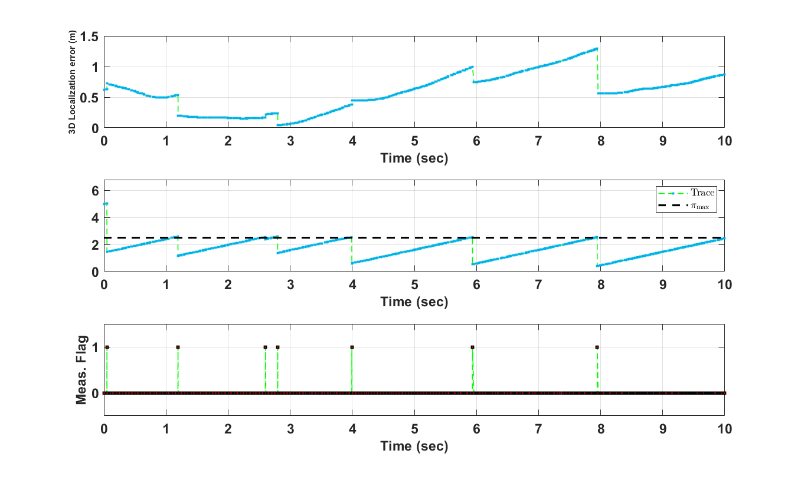

# Event-Triggered-Diffusion-Kalman-Filters

The presentation of the our paper at ICCPS - CPS week 2020 can be found at the following video. <br />
[](https://youtu.be/u_tsOv4m5Jk)


The next video is for localizing a Quadrotor in 9x10m lab while saving the resources by using an event-triggered algorithm. The data and the code structure can be used for testing other estimation and localization algorithms.The used algorithm is Event-Triggered Diffusion Kalman Filter. The blue rectangular is the Quadrotor real position using the Motion Capture system which is used to get the ground-truth location of the Quadrotor. The red plus is the estimated position of the Quadrotor. The ellipses are based on the diffusion error covariance matrix. The complete experimental setup is shown in our [paper](https://arxiv.org/pdf/1711.00493.pdf). <br /><br />


[](https://youtu.be/IcBoE3KHGwQ)

[](https://youtu.be/IcBoE3KHGwQ)

To regenerate the video, follow these steps:<br />
1- run the main file "run_event_DEKF.m" which runs based on the real data at log ped01 in the logs folder <br /> 
3- To save the movie, set<br />
SAVEMOVIE = true; 
at to save the generated movie under the video folder.<br />
4- This generates mat file (temp by default) under the cache folder. <br />5- run "plot_snapshot.m" to plot event-triggered localization results. This plots a figure close to the following figure

<br />
<br />
5- If you run "run_event_DEKF.m" for many thresholds and would like to get a figure showing the statiscs in Figure 7 and 8 in our [paper](https://arxiv.org/pdf/1711.00493.pdf), run Generate_reports.m over the the chosen thresholds then run statisticsAll.m.
<br />
<br />
<br />
To run the data set using traditional centralized Extended Kalman filter run "run_EKF.m" then run "plot_EKF.m"
<br />
<br />
The class folder has the following main classes<br />
1- DataParserROS.m: parses the log files.<br />
2- Measurement.m: each measurement in the log file would make an object of this class<br />
3- Node.m: every node would make an object of this class <br />
4- NetworkManager.m: distributes the measurements and the estimates between nodes <br />

Under the logs folder, you can find one folder for each scenario. For example, "ped01 " contains: <br />1- mocap.cvs: The ground truth location of a flying quadrotor <br /> 2- ntbtiming.cvs: The timing frames sent between the nodes to calculate the relative distances. <br /> <br /> 
Our [paper](https://arxiv.org/pdf/1711.00493.pdf) BibTex:

```
@inproceedings{eventtriggered,
    title={Event-Triggered Diffusion Kalman Filters},
    author={Alanwar, Amr and Said, Hazem and Mehta, Ankur and Althoff, Matthias},
    year={2020},
    booktitle={Proceedings of the 11th ACM/IEEE International Conference on Cyber-Physical Systems},
}
```
The early version of this code was in the following work in collaboration with Dr. Paul Martin.

```
@inproceedings{alanwar2017d,
  title={D-slats: Distributed simultaneous localization and time synchronization},
  author={Alanwar, Amr and Ferraz, Henrique and Hsieh, Kevin and Thazhath, Rohit and Martin, Paul and Hespanha, Joao and Srivastava, Mani},
  booktitle={Proceedings of the 18th ACM International Symposium on Mobile Ad Hoc Networking and Computing},
  pages={14},
  year={2017},
  organization={ACM}
}
```


